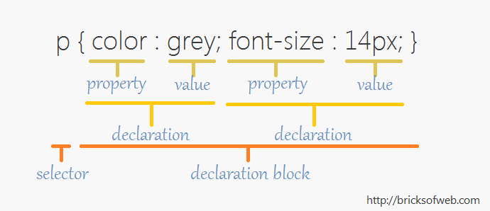

## <b>September 12<br/> Semantic HTML & CSS</b>

### Homework party

### UX intro
* UX (User Experience) is baout how someone interacts with a product (any product, not just a website)
* wireframes are means through which we can test out throries of how people will navigate a site.
* Wireframes focus on organization, not design (though designers and developers both rely on them).


### Semantic HTML
* Semantic HTML describes the content of a page to the browser and the developer. We'll use it to screw around with formatting on Thursday. 

* ```<header>``` - introduction for a section, or for the body. Read more at [w3c html spec](https://www.w3.org/html/wg/drafts/html/master/semantics.html#the-body-element)
* ```<article>``` -  "a self-contained item that is, in principle, independently distributable or reusable, e.g. in syndication. Examples: A forum post, a magazine or newspaper article, a blog entry, a user-submitted comment, an interactive widget or gadget, or any other independent item of content." (via [w3c html spec](https://www.w3.org/html/wg/drafts/html/master/semantics.html#the-article-element))
* ```<section>``` - "thematic grouping of content." "Examples of sections would be chapters, the various tabbed pages in a tabbed dialog box, or the numbered sections of a thesis. A Web site's home page could be split into sections for an introduction, news items, and contact information." (via [w3c html spec](https://www.w3.org/html/wg/drafts/html/master/semantics.html#the-section-element))
* ```<nav>``` - "major navigation block" [via w3c html spec](https://www.w3.org/html/wg/drafts/html/master/semantics.html#the-nav-element)
* ```<aside>``` - content that is not directly related to the surrounding content. For example, a twitter feed, advertising, links to other websites, links to other content on this website, or a pull quote from the article that repeats something from the article (i.e. it is not an essential part of the article). Read more at [w3c](https://www.w3.org/html/wg/drafts/html/master/semantics.html#the-aside-element).
* ```<figure>``` - a self contained unit, optionally with a caption (```figcaption```). Often used for images. Read more at [w3c](https://www.w3.org/html/wg/drafts/html/master/semantics.html#the-figure-element).
* ```<main>``` - Contains the main content of the page. It can only be used once per page. Read more at [w3c](https://www.w3.org/html/wg/drafts/html/master/semantics.html#the-main-element) and [html5doctor](http://html5doctor.com/the-main-element/). 
* ```<time>``` - Use with a machine-readable timestamp in the ``datetime`` attribute, and a human-readable description. Example:   ```<time datetime="2005-10-07">October</time>```. Read more at [CSS Tricks](https://css-tricks.com/time-element/).
* ```<mark>``` - Used to <mark>highlight</mark> text. Read more [here](https://developer.mozilla.org/en-US/docs/Web/HTML/Element/mark).

### Divs and spans
* ```span``` - display "inline" - useful for text
* ```div``` - display "block"

### Information Architecture
* site-wide orginization of the pages 
* think of it as a high-level map


### Routes Links Directories
* how we organize content in our sites
* identifying page names
* identifying names in folders
* linking throughout a site shorthand 

### HW:

* Read "[How We Really Use the Web](http://www.sensible.com/chapter.html)" from Steve Krug's book <i>Don't Make Me Think</i>.
* Read "[Five important tips for wireframing](http://mediatemple.net/blog/tips/five-important-considerations-for-wireframing/)"
* Create a Site Map for your project, or for an existing website
* Create a Wireframe for an idealized version of your apartment site, or for an existing website.

## <b>September 14<br/>CSS</b>

[Code in class](https://github.com/shfitz/DM2193-Intro-to-Web-F17/tree/master/css-week2-class%20examples)

### CSS - Cascading Style Sheet
* Syntax:
    * Selector
    * Declaration Block
    * Property
    * Value
    * Comments: 
```/*this is a comment/*```


* Selector Types:
    * Universal: ```*```
    * Element: ``li``
    * Class: ```.class-name```
    * Pseuo-Element: ``a:hover``, ``li:first-child``, ``li:before``
    * Pseudo-class: ```.class-name:hover```
    * ID: ```#id-name```
    * Child (direct descendant): ``li > a``
    * Descendant (any child): ``li a``
    * Read more: http://www.w3schools.com/cssref/css_selectors.asp
* Rules can have multiple selectors, separated by commas, i.e.

```
p, div {
  display: inline;
}
```
* Cascade Specificity
    * Order:
        1. inline ``style=`` tag is most specific (but don't use it!)
        2. ID tag #
        3. class / psuedoclass
        4. Elements / pseudo-elements
    *  If two rules conflict, the last rule overwrites the first rule.


HW: 
* Either create a new site with CSS styling and a clear site hierarchy, or style your apartment navigation pages with CSS. Make sure pages have a clear header, footer, menu and side column. Play around with any CSS properties we have covered so far.
* Read "[The Web We Lost](http://anildash.com/2012/12/the-web-we-lost.html)" and follow up, "[Rebuilding the web we lost](http://anildash.com/2012/12/rebuilding-the-web-we-lost.html)" by Anil Dash. We'll discuss these in class atthe beginning. 

